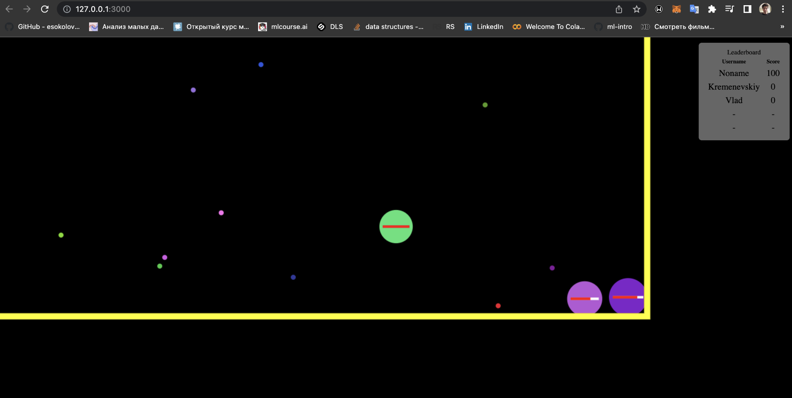

## Multiplayer Server-Client IO.GAME
> Online game running directrly in browser
> Current version already supporting multiplying in local network

> Developping by Vlad Kremenevskiy
> Group: 953501

> Now implemented: working server handled all players and current logic
> Basic client version 

> Future things:
- Better logic:
-- eating others
-- updating player skills: hp, hp regen, speed, shooting speed, damage
-- food spawn 
-- nicknames show
-- game design 
-- starting page

---
### Game Preview


___

## How to run:
### 1. Run Server
#### Run Server in develop mode
```angular2html
1. npm run all
2. npm run dev -> npm run develop 
```

#### Run Server in production mode
```bash
1. npm run build -> npm run start
2. npm run prod
```
### 2. Visit localhost on port 3000 in browser
#### In Browser:
```bash
http://localhost:3000
```

### 3. Invite friends, join local network and
## PLAY 😈 !!!


___

### Languages and frameworks used in project:
* JavaScript
* Node
* HTML + CSS

___
  